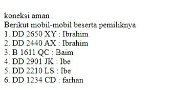
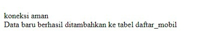

# Koneksi Database 
## Kode Program 

```php 
<?php
  
//koneksi ke database

$koneksi = mysqli_connect('localhost', 'root', '', 'rental_mobil');

  

if ($koneksi) {

    echo "<br> koneksi aman <br>";

} else {

    echo "error, tidak bisa koneksi ke database";

}
```

## Hasil


## Analisis 

1. Kode ini melakukan koneksi ke database menggunakan fungsi `mysqli_connect()`.
2. Fungsi `mysqli_connect()` membutuhkan empat parameter: hostname, username, password, dan nama database.
3. Jika koneksi berhasil, variabel `$koneksi` akan menyimpan objek koneksi.
4. Setelah koneksi, kode melakukan pengecekan apakah koneksi berhasil atau tidak.
5. Jika koneksi berhasil, kode akan menampilkan pesan "koneksi aman".
6. Jika terjadi error saat koneksi, kode akan menampilkan pesan "error, tidak bisa koneksi ke database".

## Kesimpulan 

Merupakan dasar untuk melakukan koneksi ke database menggunakan PHP. Hal ini sangat penting dalam pengembangan aplikasi berbasis web, karena aplikasi biasanya membutuhkan akses ke database untuk menyimpan dan mengambil data.

# Tampilkan Data
## Kode Program 

```php
<!DOCTYPE html>

<html lang="en">

<head>

    <meta charset="UTF-8">

    <meta name="viewport" content="width=device-width, initial-scale=1.0">

    <title>index tabel</title>

</head>

<body>

    <h2>Data Siswa XI RPL 1</h2>

    <table border="5">

    <tr>

        <th>id_siswa</th>

        <th>Gambar</th>

        <th>nama</th>

        <th>email</th>

        <th>jenis_kelamin</th>

        <th>alamat</th>

        <th>Aksi</th>

    </tr>

  

<?php

    include "koneksi.php";

    $i = 1;

    $query = mysqli_query($koneksi, "SELECT * FROM siswa");

    while ($data = mysqli_fetch_array($query)) {

    ?>

  

    <tr>

        <td><?php echo $i; ?></td>

        <td>

            " alt="gambar" width="100px">

        </td>

        <td><?php echo $data['nama']; ?></td>

        <td><?php echo $data['email']; ?></td>

        <td><?php echo $data['jenis_kelamin']; ?></td>

        <td><?php echo $data['alamat']; ?></td>

  

        <td>

            <a href="ubah.php?id=<?= $data['id_siswa']; ?>">Ubah</a> |

            <a href="hapus.php?id=<?= $data['id_siswa']; ?>">Hapus</a> |

        </td>

    </tr>

    <?php

    $i++;

    }

    ?>

    </table>

</body>

</html>
```

## Hasil



## Analisis 

- Deklarasi `<!DOCTYPE html>` menunjukkan bahwa dokumen ini adalah dokumen HTML5. Elemen `<html lang="en">` menunjukkan bahwa bahasa utama dari dokumen ini adalah bahasa Inggris.
- **Meta Tag**: `<meta charset="UTF-8">` menetapkan encoding karakter ke UTF-8. `<meta name="viewport" content="width=device-width, initial-scale=1.0">` memastikan halaman web ditampilkan dengan benar pada perangkat seluler dengan menetapkan lebar viewport sama dengan lebar perangkat.
- **Judul Halaman**: `<title>index tabel</title>` menetapkan judul halaman yang akan muncul di tab browser.
- **Heading**: `<h2>Data Siswa XI RPL 1</h2>` menampilkan heading tingkat 2 dengan teks "Data Siswa XI RPL 1".
- **Tabel**: `<table border="5">` membuat tabel dengan border tebal (5 piksel). Bagian `<tr>` dan `<th>` digunakan untuk membuat header tabel.
- **Menghubungkan ke Database**: `include "koneksi.php";` menyertakan file eksternal yang berisi koneksi ke database. File `koneksi.php` biasanya berisi kode untuk menghubungkan ke database MySQL menggunakan `mysqli_connect`.
- **Inisialisasi Counter**: `$i = 1;` menginisialisasi variabel counter yang digunakan untuk menampilkan nomor urut siswa.
- **Query Database**: `mysqli_query($koneksi, "SELECT * FROM siswa")` menjalankan query SQL untuk mengambil semua data dari tabel `siswa`.
- **Looping Melalui Data**: `while ($data = mysqli_fetch_array($query)) {}` adalah loop yang digunakan untuk iterasi setiap baris hasil query. `mysqli_fetch_array` mengambil hasil query sebagai array asosiatif.
- **Menampilkan Data**: 
  - `<td><?php echo $i; ?></td>` menampilkan nomor urut.
  - `" alt="gambar" width="100px">` menampilkan gambar siswa yang diambil dari direktori `img` dengan lebar 100 piksel.
  - `<td><?php echo $data['nama']; ?></td>`, `<td><?php echo $data['email']; ?></td>`, `<td><?php echo $data['jenis_kelamin']; ?></td>`, `<td><?php echo $data['alamat']; ?></td>` menampilkan data siswa lainnya.
- **Aksi (Ubah dan Hapus)**:
  - `<a href="ubah.php?id=<?= $data['id_siswa']; ?>">Ubah</a> | <a href="hapus.php?id=<?= $data['id_siswa']; ?>">Hapus</a>` membuat link untuk mengubah dan menghapus data siswa berdasarkan `id_siswa`.
- **Inkrementasi Counter**: `$i++;` menambah nilai counter setelah setiap iterasi.

## Kesimpulan

Skrip ini secara keseluruhan berfungsi untuk menampilkan data siswa dalam bentuk tabel dengan informasi dasar seperti nama, email, jenis kelamin, alamat, dan gambar. Setiap baris data juga menyediakan tautan untuk mengubah atau menghapus data siswa tersebut. Integrasi dengan database memungkinkan data ditampilkan secara dinamis.

# Tambahkan Data
## Kode Program 

```php
<!DOCTYPE html>
<html lang="en">
<head>
    <title>Document</title>
</head>
<body>
    <h2>Tambah Data</h2>
    <?php
    include "koneksi.php";
    function upload(): string
{
    $nameImage = $_FILES['gambar']['name'];
    $directoryFile = $_FILES['gambar']['tmp_name'];
    $errorImage = intval($_FILES['gambar']['error']);
    $sizeFile = $_FILES['gambar']['size'];
    // cek apakah gambar ada
    if ($errorImage === 4) {
        echo "<script>alert('Anda Belum Upload Gambar')</script>";
        return false;
    }
    // mengambil ekstensi file
    $validType = ['svg', 'jpg', 'png', 'jpeg', 'webp'];
    $extensionFile = explode(".", $nameImage);
    $extensionValid = strtolower(end($extensionFile));
    // cek apakah yang diupload gambar atau bukan
    if (!in_array($extensionValid, $validType)) {
        echo "<script>alert('yang anda Upload bukan gambar')</script>";
        return false;
    }

    // cek size file
    if ($sizeFile > 3_000_000) {
        echo "<script>alert('Ukuran File Terlalu Besar!!(Maks 3MB)')</script>";
        return false;
    }

    // upload file
    $nameImage = uniqid() . "." . $extensionValid;
    move_uploaded_file($directoryFile, "img/{$nameImage}");

    // mengembalikan namafile yg sudah divalidasi
    return $nameImage;
}

    if (isset($_POST['simpan'])) {
        $nama = $_POST['nama'];
        $email = $_POST['email'];
        $jenis_kelamin = $_POST['jenis_kelamin'];
        $alamat = $_POST['alamat'];
        $gambar = upload();
        if (!$gambar) {
            return false;
        }
  
        // * true / false
        $query = mysqli_query($koneksi, "INSERT into
        siswa(nama,email,jenis_kelamin,alamat,gambar)
        values ('$nama','$email','$jenis_kelamin','$alamat','$gambar')");

        if ($query == true) {
            echo "<script>
            alert('Tambah data Berhasil')
            window.location.href='table.php'
            </script>";
        } else {
            echo '<script>alert("Tambah data gagal")</script>';
        }
    }
    ?>
    <form method="post" enctype="multipart/form-data">
        <table>
            <tr>
                <td>Nama</td>
                <td><input type="text" name="nama"></td>
            </tr>
            
            <tr>
                <td>Email</td>
                <td><input type="text" name="email"></td>
            </tr>
            
            <tr>
                <td>Jenis Kelamin</td>
                <td>>
                    <select name="jenis_kelamin">
                        <option>Laki-laki</option>
                        <option>Perempuan</option>
                    </select>
                </td>
            </tr>

            <tr>
                <td>Alamat</td>
                <td><input type="text" name="alamat"></td>
            </tr>

            <tr>
                <td>Gambar</td>
                <td><input type="file" name="gambar"></td>
            </tr>

            <tr>
                <td></td>
                <td>
                    <button name="simpan" type="submit">Simpan</button>
                    <button type="reset">Reset</button>
                    <a href="table.php">Kembali</a>
                </td>
            </tr>
        </table>
    </form>
</body>
</html>
```

## Hasil



## Analisis 

1. **Koneksi ke Database**:
   - Program ini menggunakan file `koneksi.php` untuk menghubungkan ke database. Hal ini memisahkan konfigurasi database dari kode utama, memudahkan pemeliharaan dan perubahan koneksi di kemudian hari.

2. **Fungsi `upload()`**:
   - Fungsi ini bertanggung jawab untuk memvalidasi dan memproses unggahan gambar. Ini mencakup:
     - Memeriksa apakah file gambar telah diunggah.
     - Memvalidasi tipe file gambar yang diizinkan (SVG, JPG, PNG, JPEG, WEBP).
     - Memvalidasi ukuran file gambar maksimum (3MB).
     - Menyimpan file gambar ke direktori `img/` dengan nama unik.
   - Fungsi ini mengembalikan nama file gambar yang valid atau `false` jika terjadi masalah.

3. **Penanganan Formulir**:
   - Saat pengguna mengirimkan formulir, program ini akan menerima data dari form (nama, email, jenis kelamin, alamat, gambar).
   - Data yang valid akan dimasukkan ke dalam database menggunakan query SQL `INSERT`.
   - Jika proses penyimpanan berhasil, akan ditampilkan pesan sukses dan pengguna akan diarahkan ke halaman `table.php`.
   - Jika proses penyimpanan gagal, akan ditampilkan pesan kesalahan.

4. **Tampilan Halaman**:
   - Halaman ini menampilkan formulir dengan input untuk nama, email, jenis kelamin, alamat, dan unggah gambar.
   - Terdapat tombol "Simpan" untuk menyimpan data, "Reset" untuk mengosongkan form, dan "Kembali" untuk mengarahkan pengguna ke halaman `table.php`.

Secara keseluruhan, program ini menyediakan fungsionalitas dasar untuk menambahkan data siswa ke dalam database, dengan validasi terhadap unggahan gambar.

## Kesimpulan 

1. Tujuan Program:
   - Program ini bertujuan untuk memungkinkan pengguna mengelola data siswa, seperti menambahkan, menyimpan, dan mengakses informasi siswa.

2. Fitur Utama:
   - Unggah dan validasi gambar siswa.
   - Penyimpanan data siswa ke dalam database.
   - Umpan balik kepada pengguna terkait proses penyimpanan data.

3. Struktur Program:
   - Terdiri dari antarmuka web (HTML) dan logika server-side (PHP).
   - Antarmuka web menyediakan formulir untuk memasukkan data siswa.
   - Logika server-side menangani proses penyimpanan data ke database.

4. Aspek Keamanan dan Optimasi:
   - Perlu ada peningkatan dalam aspek keamanan, seperti validasi input untuk mencegah serangan SQL Injection.
   - Proses unggah dan penyimpanan gambar dapat dioptimalkan, misalnya dengan melakukan resizing atau kompresi.

# Ubah Data
## Kode Program 

```php

<!DOCTYPE html>

<html lang="en">  

<head>

    <title>Document</title>

</head>
<body>

    <h2>Ubah Data</h2>

    <?php

    include "koneksi.php";

    $id = $_GET['id'];  

    if (isset($_POST['simpan'])) {

        $nama = $_POST['nama'];

        $email = $_POST['email'];

        $jenis_kelamin = $_POST['jenis_kelamin'];

        $alamat = $_POST['alamat'];
        $query = mysqli_query($koneksi, "UPDATE siswa SET

                                        nama='$nama',                      email='$email',                     jenis_kelamin='$jenis_kelamin',     alamat='$alamat'
    WHERE id_siswa=$id");

        if ($query) {

            echo "<script>

            alert('ubah data Berhasil')

            window.location.href='table.php'

            </script>";

        } else {

            echo '<script>alert("ubah data gagal")</script>';

        }

    }  

    $query = mysqli_query($koneksi, "SELECT * FROM siswa where id_siswa=$id");

    $data = mysqli_fetch_array($query);

    if ($data == "") {

        die('Data tidak ada');

    }

    ?>

    <form method="post">

        <table>

            <tr>
                <td>Nama</td>

                <td><input type="text" value="<?= $data['nama'] ?>" name="nama"></td>

            </tr>

            <tr>

                <td>Email</td>

                <td><input type="text" value="<?= $data['email'] ?>" name="email"></td>

            </tr>

            <tr>

                <td>Jenis Kelamin</td>
                <td>>
                    <select name="jenis_kelamin">
                  <option 
                  <?php if ($data['jenis_kelamin'] == "laki-laki")
                            echo 'selected'; ?>>Laki-laki</option>

                        <option <?php if ($data['jenis_kelamin'] == "perempuan")
                            echo 'selected'; ?>>Perempuan</option>

                    </select>

                </td>

            </tr>
            ​​​<tr>

                <td>Alamat</td>

                <td><input type="text" value="<?= $data['alamat'] ?>" name="alamat"></td>

            </tr>
            <tr>
                <td></td>

                <td>

                    <button name="simpan" type="submit">Ubah</button>

                    <button type="reset">Reset</button>

                    <a href="table.php">Kembali</a>

                </td>

            </tr>

        </table>

    </form>  

</body>  

</html>
```

## Hasil


## Analisis 

1. Kode program ini merupakan halaman untuk mengubah data siswa yang disimpan dalam database.
2. Pada bagian awal, kode melakukan koneksi ke database menggunakan file "koneksi.php".
3. Variabel `$id` diambil dari parameter `GET` pada URL, yang menunjukkan ID siswa yang akan diubah.
4. Jika tombol "Ubah" (`name="simpan"`) ditekan, maka data baru yang dimasukkan ke dalam form akan digunakan untuk memperbarui data siswa di database dengan query `UPDATE`.
5. Jika proses pembaruan berhasil, maka akan muncul pesan "ubah data Berhasil" dan pengguna akan diarahkan ke halaman "table.php".
6. Jika proses pembaruan gagal, maka akan muncul pesan "ubah data gagal".
7. Pada akhir kode, data siswa yang akan diubah diambil dari database dan ditampilkan dalam form.

## Kesimpulan 

Kode program ini merupakan halaman untuk mengubah data siswa yang disimpan dalam database. Pengguna dapat mengisi form dengan data baru dan menyimpannya ke dalam database. Jika proses pembaruan berhasil, maka pengguna akan diarahkan ke halaman "table.php". Jika proses pembaruan gagal, maka akan muncul pesan kesalahan.

# Hapus Data
## Kode Program 

```php
<?php
 
 include('koneksi.php');

if(isset($_GET['id'])){

$id = $_GET['id'];

    $query = mysqli_query($koneksi, "DELETE FROM siswa WHERE id_siswa = $id");
   if($query) {
            echo "<script>
            alert('Hapus data Berhasil')
            window.location.href='table.php'
            </script>";
        }else {
            echo '<script>alert("Hapus data gagal")</script>';
        }
}
?>
```

## Hasil


## Analisis 

1. Kode program ini merupakan halaman untuk menghapus data siswa yang disimpan dalam database.
2. Pada bagian awal, kode melakukan koneksi ke database menggunakan file "koneksi.php".
3. Variabel `$id` diambil dari parameter `GET` pada URL, yang menunjukkan ID siswa yang akan dihapus.
4. Jika variabel `$id` ada, maka akan dilakukan proses penghapusan data siswa di database dengan query `DELETE FROM`.
5. Jika proses penghapusan berhasil, maka akan muncul pesan "Hapus data Berhasil" dan pengguna akan diarahkan ke halaman "table.php".
6. Jika proses penghapusan gagal, maka akan muncul pesan "Hapus data gagal".

## Kesimpulan 

Merupakan halaman untuk menghapus data siswa yang disimpan dalam database. Pengguna dapat menghapus data siswa berdasarkan ID yang diberikan melalui parameter `GET`. Jika proses penghapusan berhasil, maka pengguna akan diarahkan ke halaman "table.php". Jika proses penghapusan gagal, maka akan muncul pesan kesalahan.

# Session/Login

# Upload & Download 
