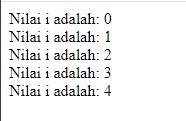
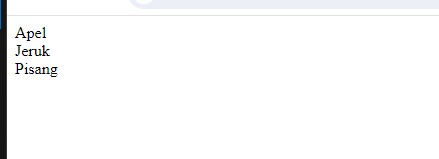
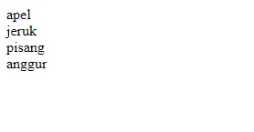
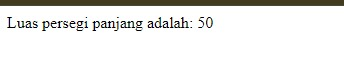

# Apa itu web dinamis dan PHP
## Web dinamis
Sebuah situs web dinamis adalah situs yang mampu menyesuaikan kontennya secara otomatis berdasarkan permintaan pengguna atau data yang diinput. Ini berbeda dengan situs statis yang kontennya tetap tidak berubah kecuali diperbarui secara manual.
## PHP
PHP adalah singkatan dari "Hypertext Preprocessor". Ini adalah bahasa pemrograman yang banyak digunakan untuk pengembangan web. PHP biasanya digunakan untuk membuat situs web dinamis, karena dapat berinteraksi dengan database, menghasilkan halaman web secara dinamis, dan melakukan berbagai tugas pemrosesan data di sisi server.


# Langkah-langkah

1. Buka AWebServer, kemudian klik izinkan jika belum pada 'apk AWebServer'
2. Terus klik document root pada "AWebServer"
3. Setelah itu klik internal 
4. Kemudian cari folder yang sudah kita bikin
5. Lalu klik centang pada folder yang sudah kita bikin
6.  Open Acode 
9. Open folder yang sudah Anda buat di file meneger 
10. Buat file baru di Acode dengan ekstensi `.php` di folder yang sudah Anda buka

# PHP Dasar

## Echo & Comentar
### Echo 
Echo adalah perintah yang digunakan untuk menampilkan teks atau variabel ke layar atau browser. Ini digunakan untuk menghasilkan output pada halaman web. Misalnya, `echo "Hello, world!";` akan menampilkan "Hello, world!" di halaman web yang terkait.

```php
<?php
echo "Hello, world";
?>
```

### Comentar 
Komentar digunakan untuk memberikan penjelasan atau catatan di dalam kode yang tidak dieksekusi oleh server. Untuk satu baris, gunakan `//`. Untuk komentar multi-baris, gunakan `/*  */`.

```php
<?
// Ini adalah komentar satu baris

/*
Ini adalah komentar
beberapa baris
*/
?>
```

## Variabel & Conts
### Variabel
Variabel dalam PHP adalah wadah untuk menyimpan data yang bisa berubah-ubah selama eksekusi program. Mereka bisa menyimpan nilai sementara seperti teks, angka, atau bahkan objek yang kompleks.
```php
<?php
  // Deklarasi variabel
  $nama_variabel;

  // Inisialisasi variabel
  $nama_variabel = nilai;

  // Penggunaan variabel
  echo $nama_variabel;
?>
```

### Conts
`const` dalam PHP digunakan untuk mendefinisikan konstanta. Konstanta adalah nilai yang tidak dapat diubah selama eksekusi skrip. Dengan menggunakan `const`, Anda dapat membuat konstanta di dalam kelas atau di luar kelas tanpa menggunakan operator `$`.
```php
<?php

// Mendefinisikan sebuah konstanta
const NAMA_KONSTANTA = nilai;

// Menggunakan konstanta
echo NAMA_KONSTANTA;

?>
```

## Operator 
### Aritmatika
#### Penjelasan
Operator aritmatika merupakan operator untuk melakukan operasi aritmatika.
Operator aritmatika terdiri dari:

| Nama Operator | Simbol |
| ------------- | ------ |
| Penjumlahan   | `+`    |
| Pengurangan   | `-`    |
| Perkalian     | `*`    |
| Pemangkatan   | `**`   |
| Pembagian     | `/`    |
| Sisa Bagi     | `%`    |

#### Program
```php
$a = 5;
$b = 2;
// penjumlahan
$c = $a + $b;
echo "$a + $b = $c";
echo "<hr>";
// pengurangan
$c = $a - $b;
echo "$a - $b = $c";
echo "<hr>";
// Perkalian
$c = $a * $b;
echo "$a * $b = $c";
echo "<hr>";
// Pembagian
$c = $a / $b;
echo "$a / $b = $c";
echo "<hr>";
// Sisa bagi
$c = $a % $b;
echo "$a % $b = $c";
echo "<hr>";
// Pangkat
$c = $a ** $b;
echo "$a ** $b = $c";
```
#### Hasil


### Perbandingan 
#### Penjelasan
Operator perbandingan adalah operator untuk membandingkan dua buah nilai.
Hasil operasi dari operator perbandingan akan menghasilkan nilai dengan tipe data _boolean_, yaitu `true` (benar) dan `false` (salah).
Berikut ini daftar operator relasi:

| Nama Operator           | Simbol          |
| ----------------------- | --------------- |
| Lebih Besar             | `>`             |
| Lebih Kecil             | `<`             |
| Sama Dengan             | `==` atau `===` |
| Tidak Sama dengan       | `!=` atau `!==` |
| Lebih Besar Sama dengan | `>=`            |
| Lebih Kecil Sama dengan | `<=`            |
#### Program
```php
// lebih besar
$c = $a > $b;
echo "$a > $b: $c";
echo "<hr>";
// lebih kecil
$c = $a < $b;
echo "$a < $b: $c";
echo "<hr>";
// lebih sama dengan
$c = $a == $b;
echo "$a == $b: $c";
echo "<hr>";
// lebih tidak sama dengan
$c = $a != $b;
echo "$a != $b: $c";
echo "<hr>";
```
#### Hasil


### Logika
#### Penjelasan
Operator logika adalah operator untuk melakukan operasi logika seperti `AND`, `OR`, dan `NOT`.
Operator logika terdiri dari:

| Nama Operator         | Simbol |
| --------------------- | ------ |
| Logika AND            | `&&`   |
| Logika OR             | `\|`   |
| Negasi/kebalikan/ NOT | `!`    |
#### Program
```php
$a = true;
$b = false;
// variabel $c akan bernilai false
$c = $a && $b;
printf("%b && %b = %b", $a,$b,$c);
echo "<hr>";
// variabel $c akan bernilai true
$c = $a || $b;
printf("%b || %b = %b", $a,$b,$c);
echo "<hr>";
// variabel $c akan bernilai false
$c = !$a;
printf("!%b = %b", $a, $c);
echo "<hr>";
```
#### Hasil


## Conditional statement
### IF
#### Penjelasan 

Struktur kontrol if digunakan untuk mengevaluasi suatu kondisi. Jika kondisi tersebut benar (true), maka blok kode di dalam if akan dieksekusi. Jika tidak, blok kode tersebut akan dilewati.

#### Struktur 

```php
<?php
if (kondisi) {  
    // Blok kode yang akan dieksekusi jika kondisi benar  
} 
?>
```

#### Program 

```php
<?php
$nilai = 80;

if ($nilai <= 81) {
    echo "Anda lulus!";
}
?>
```

#### Hasil


#### Analisis 

Dalam program ini, hanya satu kondisi yang dievaluasi. Jika kondisi tersebut benar, maka pesan "Anda lulus!" akan ditampilkan. Jika tidak, tidak ada tindakan yang diambil.

#### Kesimpulan Program 

Program menggunakan if tanpa else dapat berguna ketika hanya satu tindakan yang perlu dilakukan jika kondisi benar.

### IF-ELSE
#### Penjelasan 

IF-ELSE adalah struktur kontrol yang memungkinkan program untuk melakukan pengujian kondisi dan menjalankan blok kode tertentu berdasarkan hasil pengujian kondisi tersebut. Dengan IF-ELSE, Anda dapat menentukan tindakan yang berbeda tergantung pada apakah kondisi yang diberikan adalah benar atau salah.

#### Struktur 

```php
<?php
if (kondisi) {
    // blok kode yang dijalankan jika kondisi bernilai benar
} else {
    // blok kode yang dijalankan jika kondisi bernilai salah
}
?>
```

#### Program 

```php
<?php
$nilai = 75;

if ($nilai >= 70) {
    echo "Selamat, Anda lulus!";
} else {
    echo "Maaf, Anda belum lulus.";
}
?>
```

#### Hasil


#### Analisis 

Jika nilai lebih besar dari atau sama dengan 70, pesan "Selamat, Anda lulus!" akan ditampilkan. Jika tidak, pesan "Maaf, Anda belum lulus." akan ditampilkan.

#### Kesimpulan Program 

Dengan IF-ELSE, Anda dapat membuat keputusan berdasarkan kondisi tertentu dalam program PHP Anda. Ini memungkinkan untuk mengontrol alur program secara dinamis berdasarkan kondisi yang ditentukan.

### IF-ELSE IF-ELSE
#### Penjelasan 

IF-ELSE IF-ELSE digunakan untuk membuat struktur kondisional di PHP. Program mengevaluasi kondisi pertama, jika benar, blok kode di dalam IF dieksekusi. Jika tidak, program mengevaluasi kondisi kedua dalam ELSE IF, dan seterusnya. ELSE adalah bagian akhir dari struktur kondisional yang dieksekusi jika tidak ada kondisi sebelumnya yang benar.

#### Struktur 

```php
<?php
   if (kondisi1) {
       // blok kode jika kondisi1 benar
   } elseif (kondisi2) {
       // blok kode jika kondisi2 benar
   } else {
       // blok kode jika tidak ada kondisi yang benar
   }
   ?>
```

#### Program 

```php
<?php
$nilai = 75;

if ($nilai >= 80) {
    echo "Nilai A";
} elseif ($nilai >= 70) {
    echo "Nilai B";
} elseif ($nilai >= 60) {
    echo "Nilai C";
} else {
    echo "Nilai D";
}
?>
```

#### Hasil


#### Analisis 

Program mengevaluasi setiap kondisi dari atas ke bawah.
   - Jika nilai `$nilai` lebih besar dari atau sama dengan 80, outputnya adalah "Nilai A". Jika tidak, maka akan mengecek kondisi berikutnya.
   - Ini berlanjut sampai program menemukan kondisi yang benar atau jika tidak ada kondisi yang benar, maka bagian ELSE akan dieksekusi.

#### Kesimpulan Program 

 IF-ELSE IF-ELSE struktur kondisional yang berguna untuk mengeksekusi blok kode berdasarkan beberapa kondisi yang berbeda. Ini memungkinkan program untuk mengambil keputusan berdasarkan berbagai situasi yang mungkin terjadi.

### Switch-Case
#### Penjelasan 

Struktur switch-case digunakan untuk melakukan pemilihan terhadap satu nilai dari sejumlah pilihan yang mungkin. Biasanya, ketika suatu kasus dipilih, eksekusi akan keluar dari struktur switch-case menggunakan pernyataan `break`. Namun, jika `break` tidak digunakan, maka eksekusi akan terus berlanjut ke kasus berikutnya tanpa memeriksa kondisi kasusnya.

#### Struktur 

```php
<?php
php
switch ($nilai) {
    case nilai_1:
        // program untuk kasus nilai_1
    case nilai_2:
        // program untuk kasus nilai_2
    ...
    default:
        // program default jika tidak ada kasus yang cocok
}
?>
```

#### Program 

```
<?php
$nilai = 2;

switch ($nilai) {
    case 1:
        echo "Nilai adalah 1. ";
    case 2:
        echo "Nilai adalah 2. ";
    case 3:
        echo "Nilai adalah 3. ";
    default:
        echo "Tidak ada nilai yang cocok. ";
}
?>
```

#### Hasil


#### Analisis 

`$nilai` adalah 2, maka program akan mencetak pesan untuk kasus 2 dan 3. Namun, pernyataan `break` tidak digunakan, sehingga eksekusi terus ke default setelah mencetak pesan untuk kasus 3.

#### Kesimpulan Program 

Pengguna switch-case tanpa break-case bisa berguna dalam beberapa situasi di mana Anda ingin menjalankan beberapa kode untuk beberapa kasus yang saling terkait tanpa perlu menulis kode yang sama berulang kali. Namun, ini harus digunakan dengan hati-hati karena bisa membingungkan dan sulit dipelihara.

## Array
### Array 1 Dimensi 
#### Penjelasan 

Array 1 dimensi dalam PHP adalah kumpulan nilai yang disimpan dalam satu variabel. Setiap nilai memiliki indeks numerik yang dimulai dari 0. Ini memungkinkan penyimpanan dan pengaksesan data secara terstruktur.

#### Struktur 

```php
<?php
 $nama_array = array(nilai1, nilai2, nilai3, ...);
 ?>
```

#### Program 

```php
<?php
// Mendefinisikan array 1 dimensi
$buah = array("Apel", "Pisang", "Jeruk");

// Mengakses nilai array
echo "Buah pertama adalah " . $buah[0]; // Output: Buah pertama adalah Apel
?>
```

#### Hasil


#### Analisis 

Penggunaan array 1 dimensi memungkinkan pengelolaan data yang efisien, terutama ketika ada kumpulan nilai yang terkait.

#### Kesimpulan Program

Array 1 dimensi di PHP adalah alat yang berguna untuk mengelola dan mengakses kumpulan nilai secara terstruktur. Dengan indeks numerik, nilai-nilai ini dapat diakses dan dimanipulasi dengan mudah.

### Array Asosiatif
#### Penjelasan 

Array asosiatif dalam PHP memungkinkan Anda untuk menyimpan data dengan kunci yang ditentukan oleh pengguna, bukan hanya indeks numerik.

#### Struktur 

```php
<?php
$student = array("nama" => "John", "umur" => 20, "kelas" => "XII");
?>
```

#### Program 

```php
<?php
// Membuat array asosiatif
$student = array("nama" => "John", "umur" => 20, "kelas" => "XII");

// Mengakses nilai dalam array
echo "Nama: " . $student["nama"] . "<br>";
echo "Umur: " . $student["umur"] . "<br>";
echo "Kelas: " . $student["kelas"] . "<br>";
?>
```

#### Hasil


#### Analisis 

- Program ini sederhana namun efektif dalam menunjukkan cara membuat dan mengakses nilai dalam sebuah array asosiatif di PHP.
- Penggunaan kunci yang deskriptif seperti "nama", "umur", dan "kelas" membuat kode menjadi lebih mudah dipahami.

#### Kesimpulan Program

Array asosiatif di PHP adalah alat yang berguna untuk menyimpan data dengan pasangan kunci-nilai. Mereka memungkinkan Anda untuk mengakses nilai dengan menggunakan kunci yang ditentukan pengguna. Hal ini membuat kode lebih fleksibel dan mudah dipelajari.

### Array Multidimensi 
#### Penjelasan 

Array multidimensi adalah array yang berisi satu atau lebih array di dalamnya. Ini memungkinkan Anda untuk menyimpan data dalam bentuk tabel yang terstruktur. Setiap elemen dalam array utama bisa menjadi array sendiri, membentuk struktur data bertingkat.

#### Struktur 

```php
<?php
$nama_array = array(
    array(nilai1, nilai2, nilai3),
    array(nilai1, nilai2, nilai3),
    array(nilai1, nilai2, nilai3)
);
?>
```

#### Program 

```
<?php
$nilai = array(
    array(80, 75, 90),
    array(85, 70, 85),
    array(90, 80, 85)
);

echo "Nilai siswa:<br>";
echo "Siswa 1: Matematika=".$nilai[0][0].", Fisika=".$nilai[0][1].", Kimia=".$nilai[0][2]."<br>";
echo "Siswa 2: Matematika=".$nilai[1][0].", Fisika=".$nilai[1][1].", Kimia=".$nilai[1][2]."<br>";
echo "Siswa 3: Matematika=".$nilai[2][0].", Fisika=".$nilai[2][1].", Kimia=".$nilai[2][2]."<br>";
?>
```

#### Hasil


#### Analisis 

Program di atas menghasilkan daftar nilai siswa dalam tiga mata pelajaran. Dengan menggunakan array multidimensi, data nilai siswa disusun dalam struktur yang terorganisir.

#### Kesimpulan Program

Array multidimensi adalah alat yang berguna dalam menyimpan dan mengorganisir data dalam bentuk tabel bertingkat di PHP.

## Var_dump
### Penjelasan 

`var_dump()` adalah sebuah fungsi di PHP yang digunakan untuk menampilkan informasi struktur dan tipe data dari suatu variabel. Fungsi ini sangat berguna dalam debugging karena memberikan informasi detail tentang variabel yang sedang diperiksa, termasuk tipe data, panjang (jika array atau string), dan nilai-nilai yang disimpan di dalamnya.

### Struktur 

```php
<?php
$variable = "Hello, world!";
var_dump($hasil);
?>
```

### Program 

```php
<?php
$variable = "Hello, world!";
var_dump($variable);
?>
```

### Hasil


### Analisis 

Program di atas menetapkan sebuah string ke variabel `$variable`, kemudian memanggil fungsi `var_dump()` untuk menampilkan informasi tentang variabel tersebut. Dalam hal ini, `var_dump()` akan menampilkan tipe data dari variabel (`string(13)` karena variabel tersebut merupakan string dengan panjang 13 karakter) dan nilai yang disimpan di dalamnya (`"Hello, world!"`).

### Kesimpulan Program

Dengan menggunakan fungsi `var_dump()`, kita dapat dengan mudah memeriksa tipe data dan nilai dari suatu variabel dalam PHP. Ini sangat membantu dalam proses debugging untuk memastikan bahwa variabel berisi nilai yang diharapkan.

## Looping (Perulangan)
### FOR
#### Penjelasan 

`for` digunakan untuk melakukan iterasi sejumlah tertentu dengan ekspresi awal, kondisi, dan ekspresi peningkatan. Ini sangat berguna saat Anda ingin melakukan sesuatu sejumlah kali yang sudah diketahui.

#### Struktur 

```php
<?php
for (ekspresi awal; kondisi; ekspresi peningkatan) {
    // kode yang akan diulangi
}
?>
```

#### Program 

```php
<?php
for ($i = 0; $i < 5; $i++) {
    echo "Nilai i adalah: $i <br>";
}
?>
```

#### Hasil



#### Analisis 

Dalam program contoh di atas, loop `for` dijalankan lima kali dengan nilai `$i` mulai dari 0 dan berhenti saat `$i` kurang dari 5. Setiap iterasi, nilai `$i` ditampilkan.

#### Kesimpulan Program

Loop `for` sangat berguna untuk melakukan iterasi sejumlah tertentu dalam sebuah program. Dengan menggunakan ekspresi awal, kondisi, dan ekspresi peningkatan, kita bisa mengontrol jumlah iterasi dan aksi yang dilakukan pada setiap iterasi.

### WHILE 
#### Penjelasan 

Perulangan while digunakan untuk menjalankan blok kode selama kondisi tertentu bernilai benar. Saat kondisi tidak lagi benar, perulangan berhenti.

#### Struktur 

```php
<?php
while (kondisi) {
    // kode yang akan dijalankan selama kondisi benar
}
?>
```

#### Program 

```php
<?php
$angka = 1;

while ($angka <= 5) {
    echo $angka . "<br>";
    $angka++;
}
?>
```

#### Hasil


#### Analisis 

Dalam program ini, variabel `$angka` diinisialisasi dengan nilai 1. Selama nilai `$angka` kurang dari atau sama dengan 5, blok kode dalam perulangan while akan dijalankan. Setiap iterasi, nilai `$angka` akan dicetak dan kemudian ditambah satu.

#### Kesimpulan Program

Perulangan while di PHP adalah alat yang berguna untuk menjalankan blok kode berulang kali selama kondisi tertentu terpenuhi. Dalam contoh ini, perulangan while digunakan untuk mencetak angka dari 1 hingga 5, menunjukkan fleksibilitas dan kekuatan perulangan dalam bahasa pemrograman PHP.

### do-while
#### Penjelasan 

Do while loop adalah jenis perulangan yang akan mengeksekusi blok kode setidaknya sekali, kemudian akan terus dieksekusi selama kondisi yang ditentukan masih benar.

#### Struktur 

```php
<?php
// Inisialisasi variabel atau kondisi awal
do {
    // Blok kode yang akan dieksekusi minimal satu kali
} while (kondisi);
?>
```

#### Program 

```php
<?php
// Inisialisasi variabel
$counter = 0;
$items = array("Apel", "Jeruk", "Pisang");

// Eksekusi minimal satu kali
do {
    echo $items[$counter] . "<br>";
    $counter++;
} while ($counter < count($items));
?>
```

#### Hasil



#### Analisis 

Dengan menggunakan do while loop, program menjamin bahwa setidaknya satu pernyataan akan dieksekusi sebelum kondisi pengecekan dilakukan. Hal ini berguna dalam situasi di mana Anda ingin memastikan bahwa blok kode dijalankan minimal sekali sebelum memeriksa kondisi.

#### Kesimpulan Program

Program tersebut berhasil mencetak semua item dalam array buah menggunakan do while loop. Ini menunjukkan kegunaan do while loop dalam menjalankan sebuah blok kode minimal sekali dan kemudian mengulanginya selama kondisi tertentu masih terpenuhi.

### Foreach
#### Penjelasan 

`foreach` digunakan untuk mengulangi setiap elemen dalam array. Dapat digunakan untuk array asosiatif (menggunakan pasangan kunci-nilai) atau array indeks (menggunakan indeks numerik). Menyederhanakan proses pengulangan daripada menggunakan loop `for` atau `while`.

#### Struktur 

```php
<?php
foreach ($array as $nilai) {
       // Lakukan sesuatu dengan $nilai
   }
?>
```

#### Program 

```php
<?php
   $buah = array("apel", "jeruk", "pisang", "anggur");

   foreach ($buah as $item) {
       echo $item . "<br>";
   }
?>
```

#### Hasil



#### Analisis 

Program menggunakan `foreach` untuk mengulangi setiap elemen dalam array `$buah`. Setiap elemen disimpan dalam variabel `$item`.Dalam loop, setiap elemen dicetak.

#### Kesimpulan Program

Penggunaan `foreach` dalam PHP mempermudah pengulangan dan pengelolaan setiap elemen dalam array. Ini lebih intuitif daripada menggunakan loop `for` atau `while`, terutama ketika berurusan dengan array yang tidak terbatas atau array asosiatif. Dengan `foreach`, Anda dapat fokus pada manipulasi nilai daripada mengelola indeks.

## Function 
### Penjelasan 

PHP Function adalah blok kode yang dapat dipanggil dan digunakan kembali dalam sebuah skrip PHP. Mereka membantu mengorganisir kode, mengurangi duplikasi, dan meningkatkan keterbacaan.

### Struktur 

```php
<?php
// Deklarasi fungsi
function nama_fungsi($parameter1, $parameter2, ...) {
    // Blok kode fungsi
    // Lakukan sesuatu dengan parameter yang diterima
    return $hasil;
}
// Panggil fungsi
$hasil = nama_fungsi(nilai1, nilai2, ...);
echo $hasil;
?>
```

### Program 

```php
<?php
// Fungsi untuk menghitung luas persegi panjang
function hitungLuasPersegiPanjang($panjang, $lebar) {
    $luas = $panjang * $lebar;
    return $luas;
}
// Panggil fungsi
$luas = hitungLuasPersegiPanjang(5, 10);
echo "Luas persegi panjang adalah: " . $luas;
?>
```

### Hasil



### Analisis 

- Program di atas mendefinisikan sebuah fungsi `hitungLuasPersegiPanjang` yang menerima dua parameter, yaitu panjang dan lebar.
- Fungsi tersebut mengembalikan hasil perkalian panjang dengan lebar, yang merupakan luas persegi panjang.
- Hasil luas kemudian dicetak menggunakan perintah `echo`.

### Kesimpulan Program 

Dengan menggunakan fungsi dalam PHP, kita dapat mengorganisir kode dengan lebih baik, menghindari duplikasi kode, dan membuat kode lebih mudah dipahami. Fungsi memungkinkan kita untuk memecah program menjadi bagian-bagian kecil yang dapat digunakan kembali, meningkatkan efisiensi dan keterbacaan kode.

## PHP Form
### Get Method
#### Penjelasan 

Metode GET adalah salah satu cara untuk mengirimkan data dari sisi klien (browser) ke sisi server (PHP) melalui URL. Data yang dikirimkan melalui metode GET akan terlihat dalam URL.

#### Program 

Form:
```php
<!DOCTYPE html>
<html lang="en">

<head>
    <title>Document</title>
</head>

<body>
    <!-- Pada atribut action, kalian tuliskan nama file php yang bertugas untuk mengelola atau menangkap data dari form tersebut. -->
    <form action="process_get.php" method="GET">
        <input type="text" name="nama_lengkap" placeholder="Masukkan nama">
        <input type="number" name="umur" placeholder="Masukkan umur"> <br>
        <button type="submit">Kirim</button>
    </form>
</body>

</html>
```

proses:
```php
<?php

// Key dari array-nya, sesuai dengan nama dari atribut name di setiap input-nya

$nama = $_GET["nama_lengkap"];
$umur = $_GET["umur"];

?>

<!DOCTYPE html>
<html lang="en">
<head>
    <meta charset="UTF-8">
    <meta name="viewport" content="width=device-width, initial-scale=1.0">
    <title>XI RPL 1 - GET</title>
</head>
<body>
    <p>Nama anda
        <!-- Ini adalah versi singkatnya dari php echo,

             yang fungsinya untuk menampilkan data -->
        <?= $nama ?>
    </p>
    <p>Umur anda <?= $umur ?> tahun</p>

</body>
</html>
```

#### Hasil


### Post Method
#### Penjelasan 

Metode POST adalah salah satu cara untuk mengirimkan data dari sisi klien (browser) ke sisi server (PHP) melalui body request HTTP. Data yang dikirimkan melalui metode POST tidak akan terlihat dalam URL.

#### Program 

Form:
```php
<!DOCTYPE html>
<html lang="en">

<head>
    <title>Document</title>
</head>

<body>
    <!-- Pada atribut action, kalian tuliskan nama file php yang bertugas untuk mengelola atau menangkap data dari form tersebut. -->
    <form action="process_post.php" method="POST">
        <input type="text" name="nama_lengkap" placeholder="Masukkan nama">
        <input type="number" name="umur" placeholder="Masukkan umur">
        <input type="password" name="password" placeholder="Masukkan password"><br>
        <button type="submit">Kirim</button>
    </form>
</body>

</html>
```

Proses:
```php
<?php
// Key dari array-nya, sesuai dengan nama dari atribut name di setiap input-nya
$nama = $_POST["nama"];
$umur = $_POST["umur"];

var_dump($_POST);

?>

<!DOCTYPE html>
<html lang="en">

<head>
    <title> XI RPL 1 - POST</title>
</head>

<body>
    <p>Nama anda <?= $_POST["nama_lengkap"] ?></p>
    <p>Umur anda <?= $umur ?> tahun</p>
    <p>Password anda aman!</p>
</body>

</html>
```

#### Hasil


